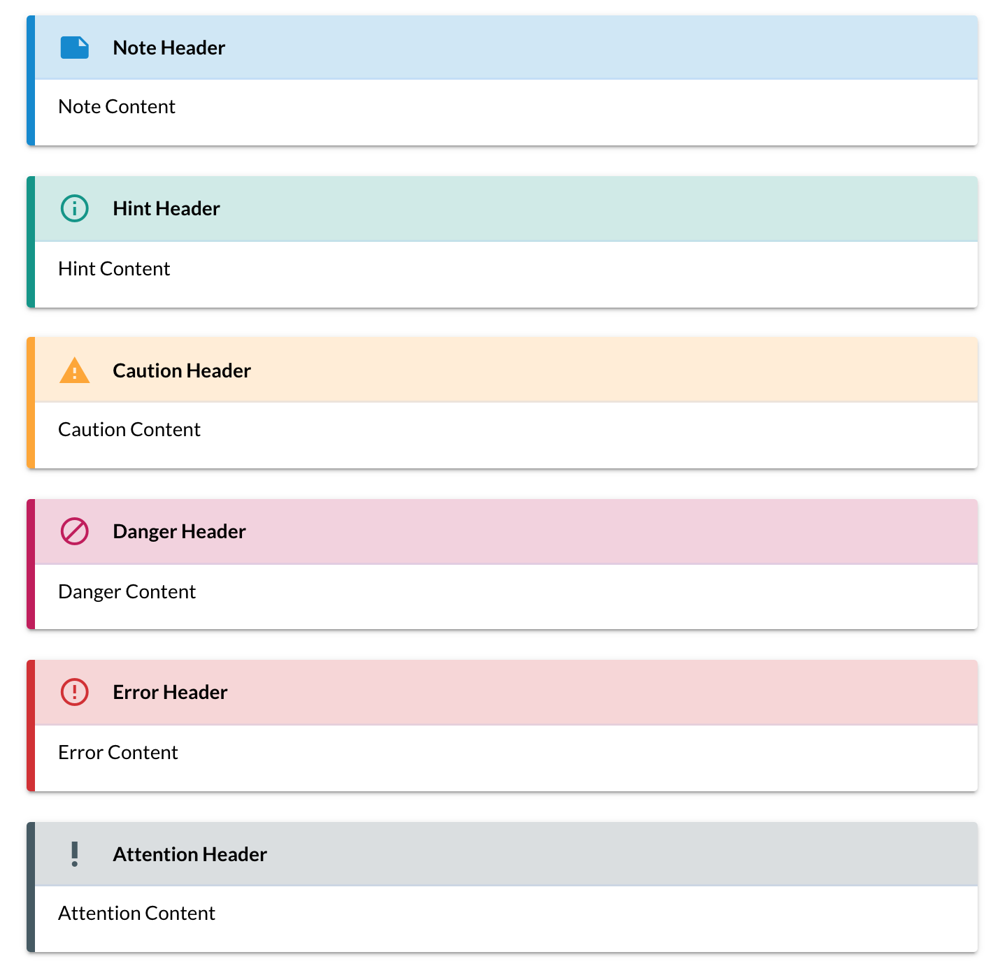
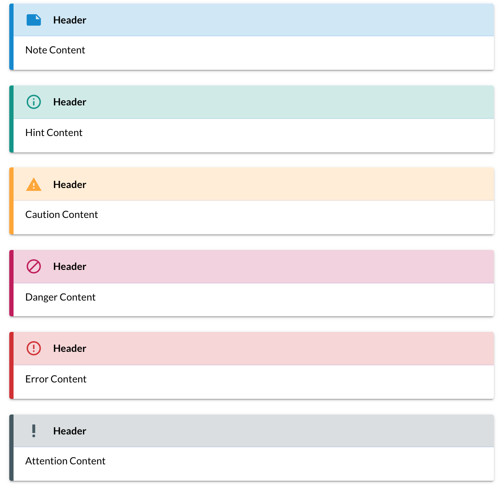

# docsify-admonition

**WARNING**: This project is not supported nor maintained anymore.

docsify-admonition is a plugin for [docsify](https://docsify.js.org/#/) to show admonitions, it was inspired by [docsify-plugin-flexible-alerts](https://github.com/zanfab/docsify-plugin-flexible-alerts) and [mkdocs-material](https://github.com/squidfunk/mkdocs-material).

## Usage

First, include below essential files in the `index.html` file:

```html
<link href="https://fonts.googleapis.com/icon?family=Material+Icons" rel="stylesheet">
<link rel="stylesheet" href="http://unpkg.com/docsify-admonition-plugin@1.0.2/build/admonition.css" />
<script src="http://unpkg.com/docsify-admonition-plugin@1.0.2/build/index.js"></script>
```

Then you can use below syntax to generate admonitions:

```markdown

> [!note][Header]
Note Content
>

> [!hint][Header]
Hint Content
>

> [!caution][Header]
Caution Content
>

> [!danger][Header]
Danger Content
>

> [!error][Header]
Error Content
>

> [!Attention][Header]
Attention Content
>
```



## Configuration

As you can see, The default configuration will show labels like `note, hint...`. To hidden these labels, you can add this configuration:

```js
window.$docsify = {
      // ...
      admonition: {
        labelVisibility: 'hidden'
      }
      //, ...
}
```

After doing that, you'll see:



## Attention

You cannot use `]` in header, since we use `]` to check the end of header! If you want to use `]` in header, use `&#93;` instead.

## License

[MIT](./LICENSE).
